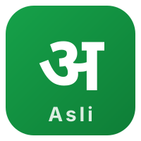
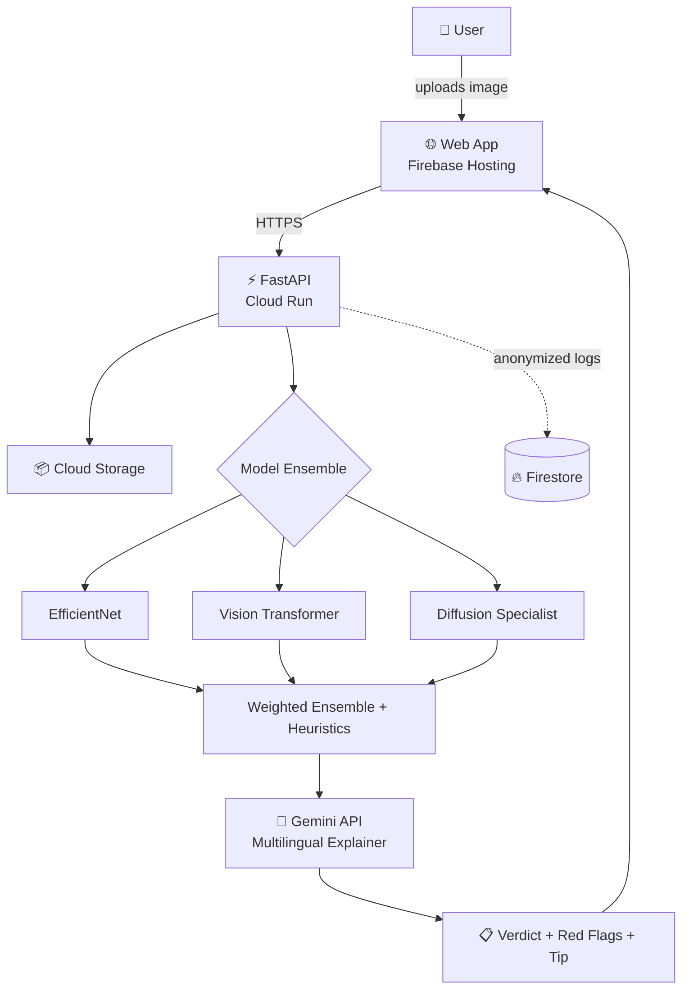

<p align="center">
  
</p>

<h1 align="center">Asli — असली या नक़ली? Know in seconds.</h1>

<p align="center">
  <b>Multilingual AI-content authenticity verification for India.</b><br>
  Built for the Google Solution Challenge 2026.
</p>

<p align="center">
  <a href="LIVE_URL">🌐 Live Demo</a> •
  <a href="VIDEO_URL">🎥 Demo Video</a> •
  <a href="API_URL/docs">📖 API Docs</a>
</p>

---

## The Problem

In 2026, the most weaponized digital asset in India is the human face.

Lakshmi, 62, received a WhatsApp video of her grandson — crying, asking for ₹2 lakhs for an emergency. The video was a deepfake. By the time the family realized, the money was gone.

This is not a one-off. India reported over ₹11,000 crore in cyber fraud losses in 2024 (CERT-In Annual Report 2024), with deepfake-driven scams among the fastest-growing vectors. The most vulnerable — elderly users, rural communities, non-English speakers — have NO accessible tools to verify what they see.

Existing AI-detection tools are English-only, technical, and built for researchers. The people who need this most can't use them.

## The Solution

**Asli** ("the real one" in Hindi) is the first AI-content verification tool built explainability-first, in Indian languages, for non-technical users.

Upload or forward a suspicious image. Within seconds, Asli returns:
- A verdict (**Asli / Nakli / Shak hai** — Real / Fake / Suspicious)
- A confidence score
- Specific red flags ("notice the unnaturally smooth skin and inconsistent earrings")
- A media-literacy tip — so you spot the next one yourself

...all in **Hindi, Gujarati, or English**, powered by Google Gemini.

## Why Asli is Different

| | Existing tools | **Asli** |
|---|---|---|
| Languages | English only | Hindi, Gujarati, English (more coming) |
| Output | Raw % score | Plain-language explanation + red flags |
| Audience | Researchers | Everyday users, especially elderly |
| Pricing | Enterprise / paid | Free for individuals, always |
| Education | None | Per-result media-literacy tip |

## SDG Alignment

- **SDG 16 — Peace, Justice, Strong Institutions:** Combats synthetic-media fraud and erosion of institutional trust.
- **SDG 10 — Reduced Inequalities:** Democratizes media verification for non-English-speaking, non-technical users disproportionately targeted by deepfake fraud.

## Architecture



## Tech Stack

**Google Cloud:**
- **Gemini API** — Multilingual explanation engine
- **Cloud Run** — Serverless container hosting
- **Firebase Hosting** — Frontend delivery, global CDN
- **Cloud Storage** — Image upload buffer
- **Firestore** — Anonymized scan logs

**AI/ML:**
- PyTorch + TensorFlow + HuggingFace Transformers
- EfficientNet, Vision Transformer, diffusion-specialized detector
- OpenCV, NumPy, SciPy for signal-level features

**Backend:** Python 3.11, FastAPI, Pydantic, Uvicorn  
**Frontend:** HTML5, TailwindCSS, vanilla JS, Lucide icons

## Quick Start

```bash
git clone https://github.com/suthardivy183-lang/asli
cd asli
pip install -r backend/requirements.txt
cp backend/.env.example .env   # add your GEMINI_API_KEY
uvicorn backend.main:app --reload
# In another terminal:
cd frontend && python -m http.server 5500
# Open http://localhost:5500
```

## API Reference

```bash
curl -X POST https://asli-api.run.app/scan \
  -F "image=@photo.jpg" \
  -F "target_language=hi"
```

See full interactive docs at `API_URL/docs`.

**Response shape:**
```json
{
  "verdict": "Nakli",
  "confidence_pct": 88,
  "explanation_en": "...",
  "explanation_local": "...",
  "red_flags": ["skin lacks visible pores", "..."],
  "learn_more_tip": "...",
  "source": "gemini",
  "cache_hit": false
}
```

## Roadmap

- **Phase 2 (M1–M3):** WhatsApp bot, video deepfake detection, 5 more languages
- **Phase 3 (M3–M6):** Browser extension, cyber-crime helpline integration, State Cyber Cell partnerships, school curriculum integration
- **Phase 4 (M6–M12):** Native mobile apps, family-sharing, public-good API for journalists

## Team

- Divydevendrabhai Suthar — Full-stack & ML — GDSC

## License

MIT — built as a public good.
